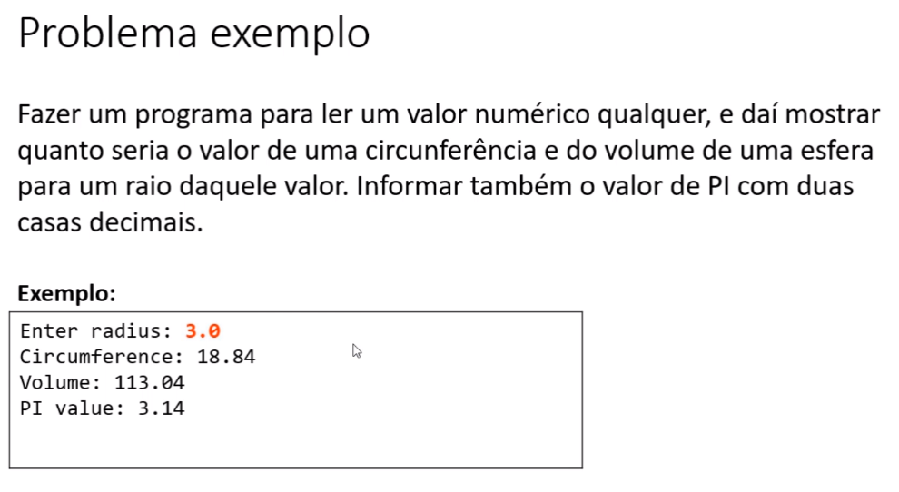

# Problema Exemplo

## Checklist

* Versão 1: métodos na própria classe do programa
=>Nota: dentro de um método estático você pode chamar membros de instância da mesma classe.

* Versão 2: classe Calculator com membros de instância

* Versão 3: classe Calculator com membros estáticos
