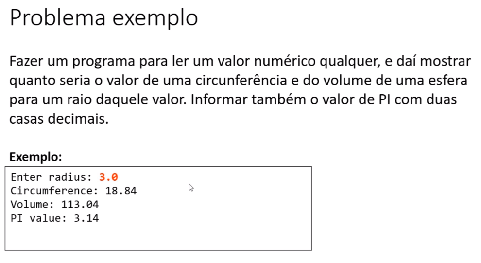
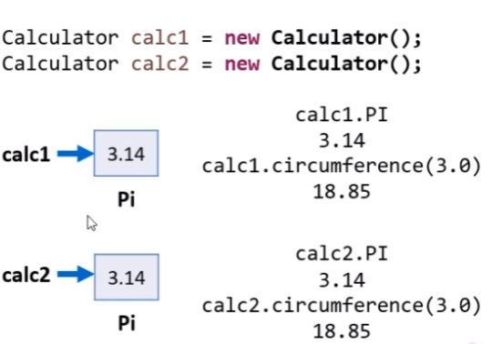

# Problema exemplo

## version 03

* Discussão

* No problema dos triângulos, cada trângulo possui sua área.

* Area() é uma operação concernete ao objeto: cada triângulo possui sua áruea.

* Já no caso da calculdora, os valores dos cálculos não mudam para calculadoras diferentes, ou seja, são cálculos estáticos. O valor de Pi também é estático.

