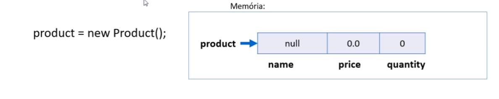

# Construtores

* É uma operação especial da classe, que executa no momento da instaciação do objeto;

* Usos comuns:

=======> Iniciar valores dos atributos

=======> Permitir ou obrigar que o objeto receba dados / dependências no momento de sua instanciação(injeção de dependência)

* Se um construtor customizado não for especificado, a classe disponibiliza o construtor padrão:

``` java
Product p = new Product();
```

* É possível especificar mais de construtor na mesma classe(sobrecarga)

## Prosposta de melhoria

Quando executamos o comando abaixo, instanciamos um produto **"product"** com seus atributos "vazios":



Entretando, faz sentido um produto que não tem nome? faz sentido um produto que não tem preço?

Com o intuito de evitar a existência de produtos sem nomes e sem peços, é possivel fazer com que seja "Obrigatória" a iniciaçao desses valores?

