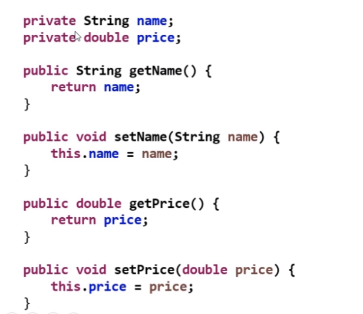

# Encapsulamento

* É um pricípio que consiste em esconder detalhes de implementação de uma classe, expondo apenas operações seguras e que mantenham
os objetos em um estadp consistente.

* Regra de ouro: o objeto deve sempre estar em um estado consistente, e a própria classe garantir isso.

## REGRA GERAL BÁSICA

* Um objeto **Não** deve expor nehum atributo(modificador de acesso **PRIVATE**)

* Os atributos devem se acessados por meio de métodos get e set

==> Padrão JavaBeans:<https://en.wikipedia.org/wiki/JavaBeans>

PADRÃO PARA IMPLEMENTAÇÃO DE GETTERS E SETTERS

