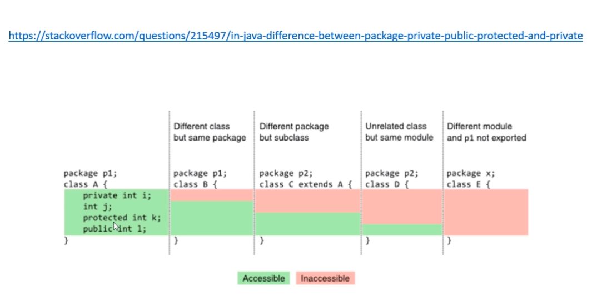

# Modificadores de acesso

* <https://doc.oracle.com/javase/tutorial/java/javaOO/accesscontrol.html>

* **private**: o membro só pode ser acessado na **própria classe**

* (nada): o membro só pode ser acesso nas classes do **mesmo pacote**

* **protected:** o membro ó pode ser acessado na **mesmo pacote**, bem como em **subclasses de pacates diferentes**

* **public**: o membro é acessado por todas classes (ao menos que ele resida em um módulo diferente que não exporte o pacote onde ele está)

