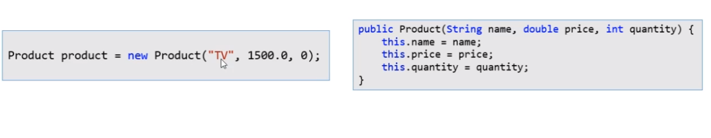
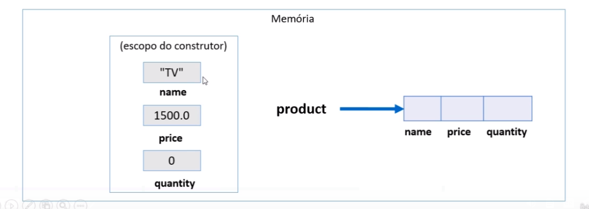
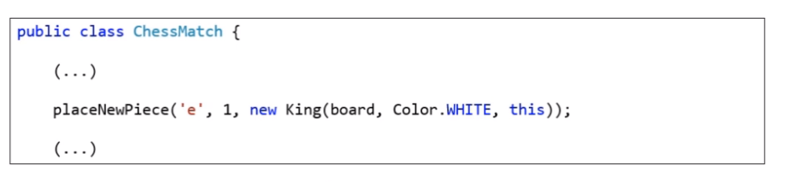

# Palavra This

* É refencia para o proprio objeto

* Uso comuns:

==> Diferenciar atributos de variáveis locais

==> Passar o próprio objeto como argumento na chamada de um método ou construtor.

## Diferenciar atributos de Variáveis locais

## Passar o próprio objeto como argumento na chamada de um método ou construtor

