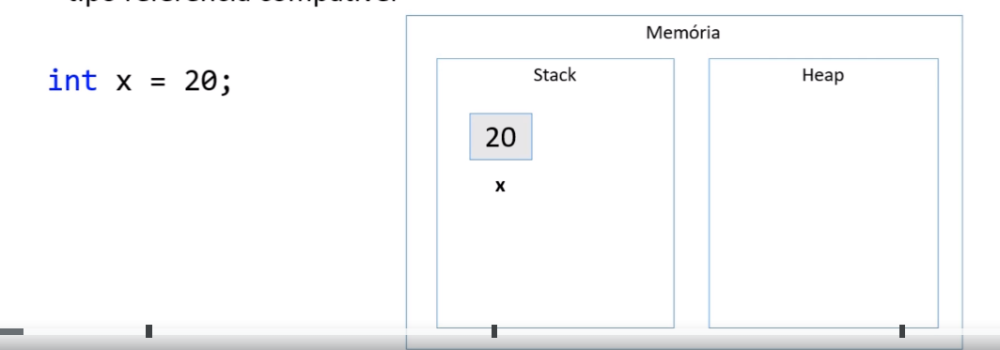
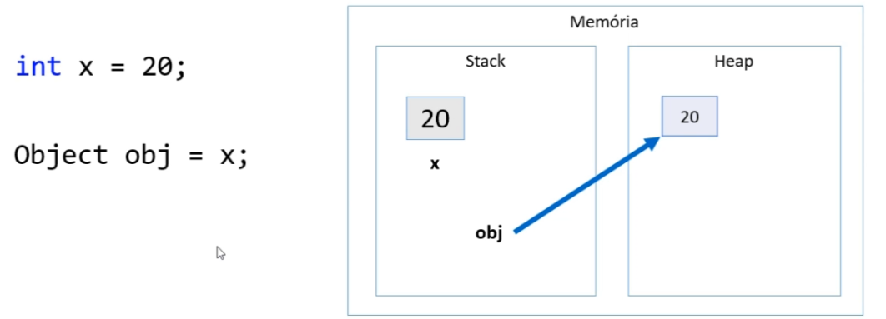
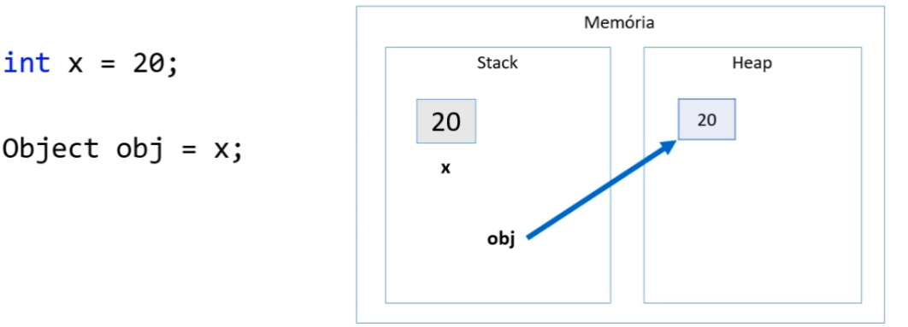
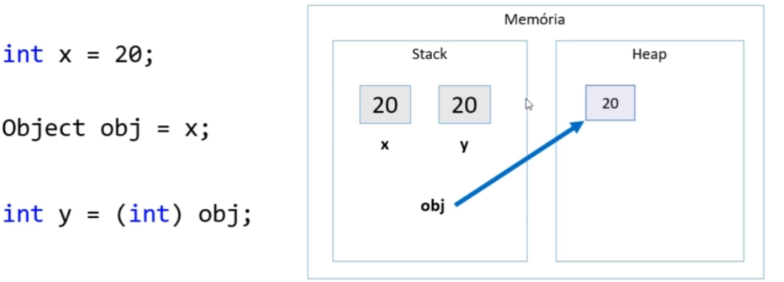
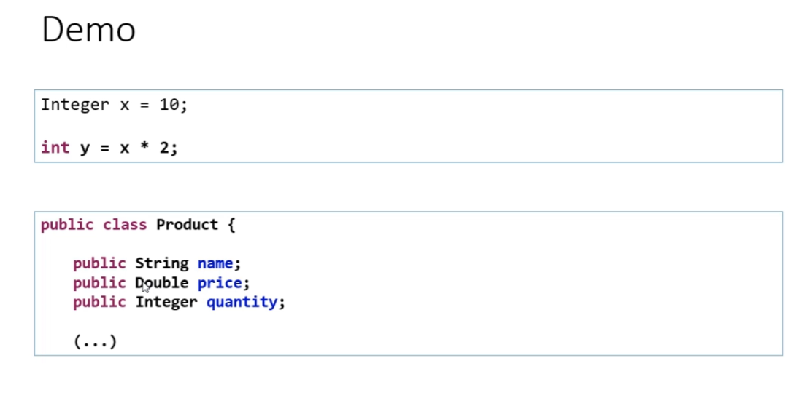

# Boxing, unboxing e wrapper classes

## Boxing

* É o processo de conversão de um objetivo tipo valor para um objeto tipo referência compatível

## Unboxing

* É o processo de conversão de um objeto tipo referência para um objeto tipo valor compatível

## Wrapper classes

* São classes equivalentes aos tipos primitivos

* Boxing e unboxing é natural na linguagem

* Uso comum: campos de entidades em sistemas de informação(IMPORTANTE!)

* Pois tipos referêcia (classes) aceitam valor null e usufruem dos recursos OO

