# Tipos referência vs. tipos valor

## Classe são tipos referência

Variáveis cujo tipo são classes não devem ser entendidas como caixas, mas sim "tentáculos" (ponteiros) para caixas

Product p1, p2;

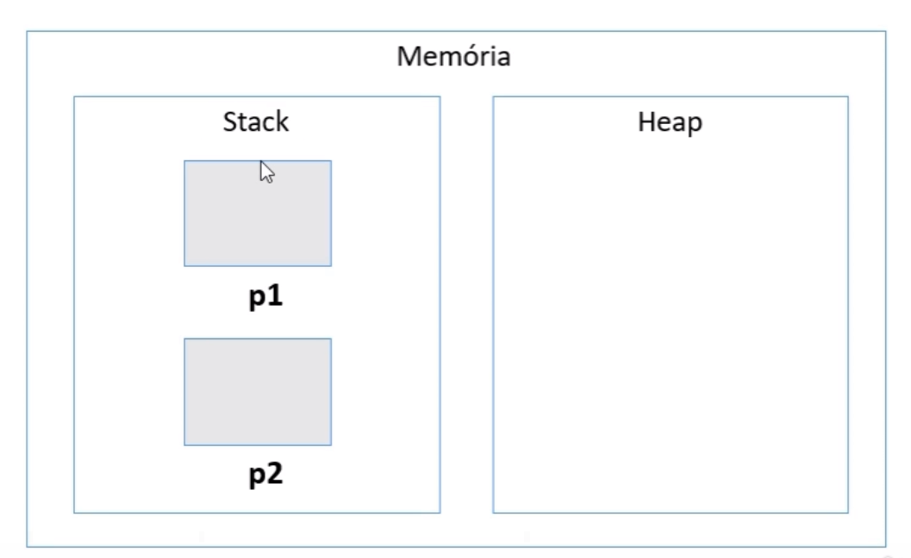

## Valor "null"

tipos referência aceitam o valor "null", que  indica que a variável aponta pra ninguém.

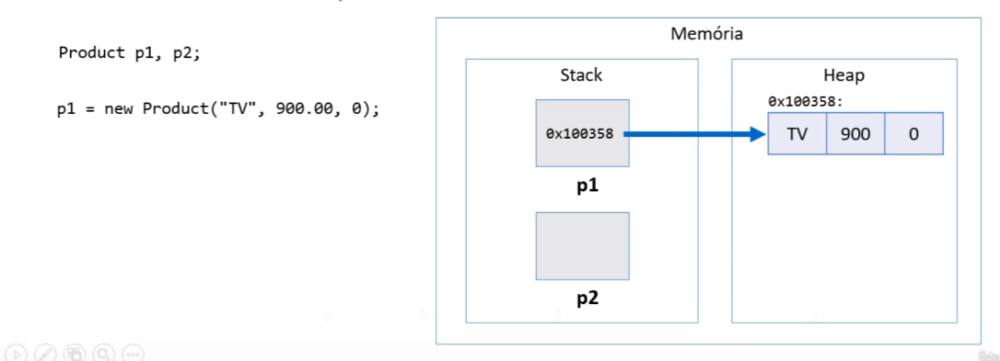

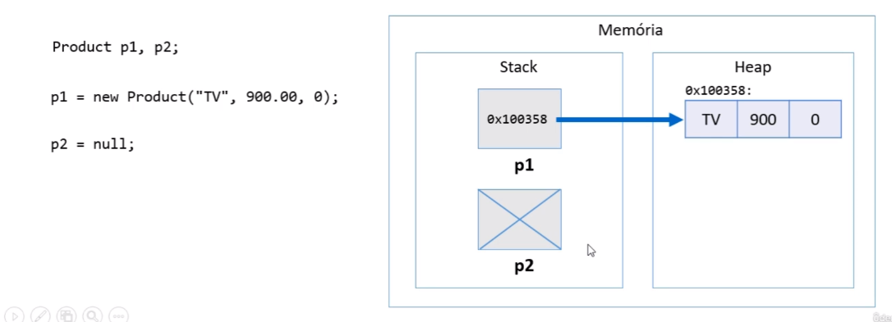

## Tipos Primitivos são tipos valor

Em Java, tipos primitivos são tipos valor. Tipos valor são CAIXAS e não ponteiros.

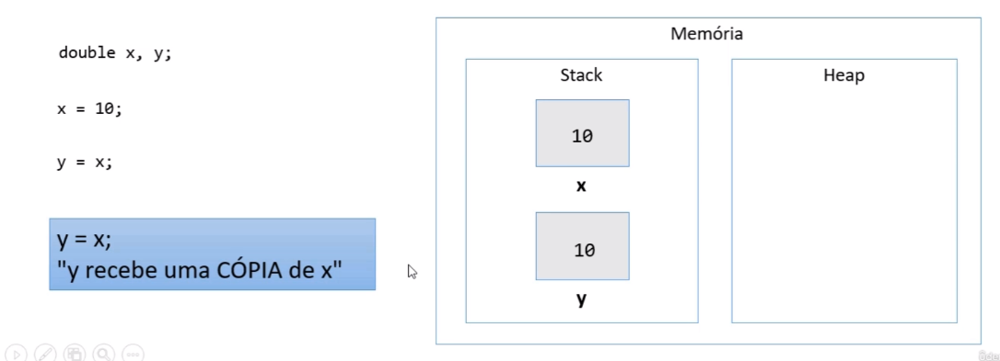

### Os 8 tipos primitivos

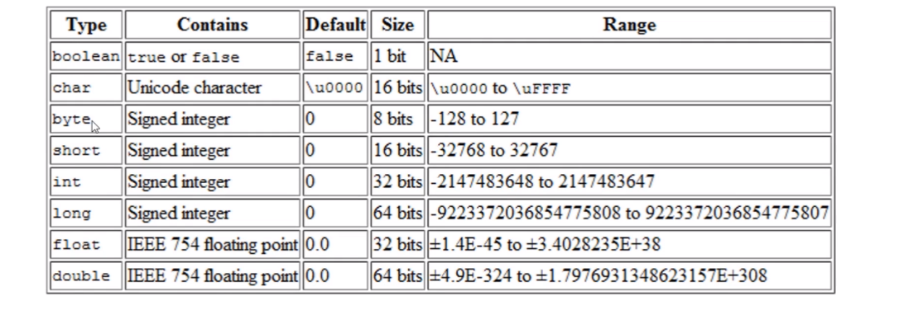

## Tipos primitivos e inicialização

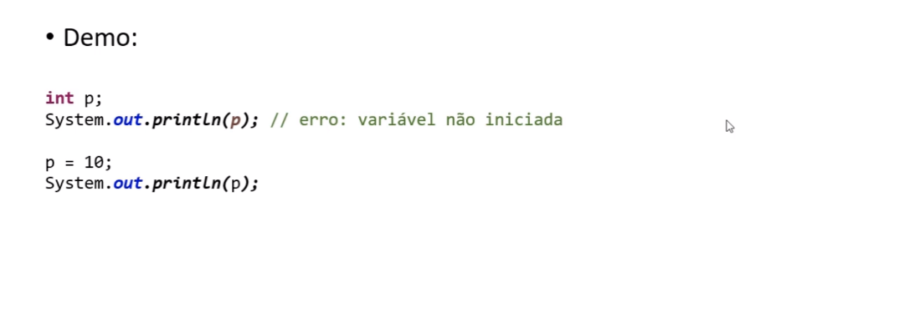

## Valores padrão

Quando alocamos (new) qualquer tipo estruturado (classe ou array), são atribuídos valores padrão aos seus elementos

* Números: 0

* Boolean: false

* char: caractere código 0

* objeto: null

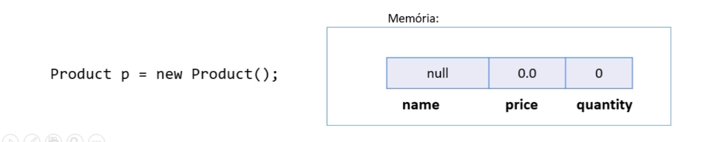

## Tipos referência vs. Tipos valor

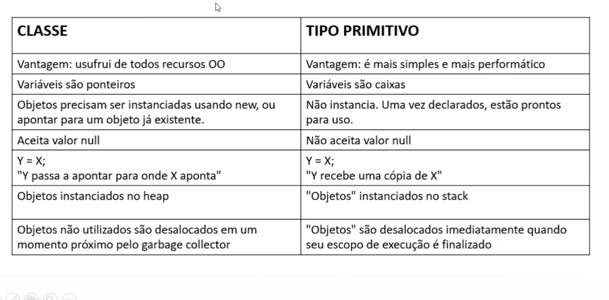

## Desalocação de memória -garbage collector e escopo local

### Garbage collector

* É um processo que automatiza o gerenciamento de memória de um programa em execução

* O garbage collecotr monitora os objetos alocados dinamicamente pelo programa (no healp), desalocando aqueles que não estão mais sendo utilizados.

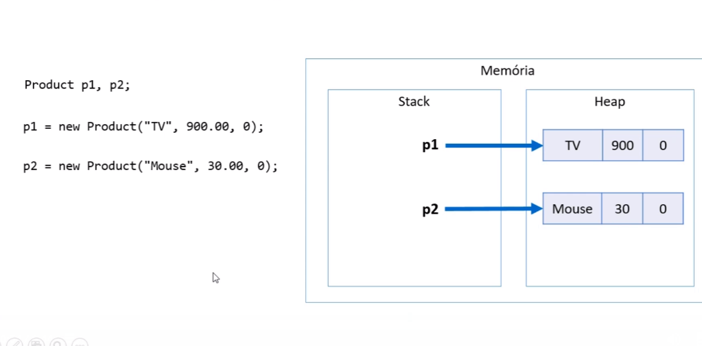

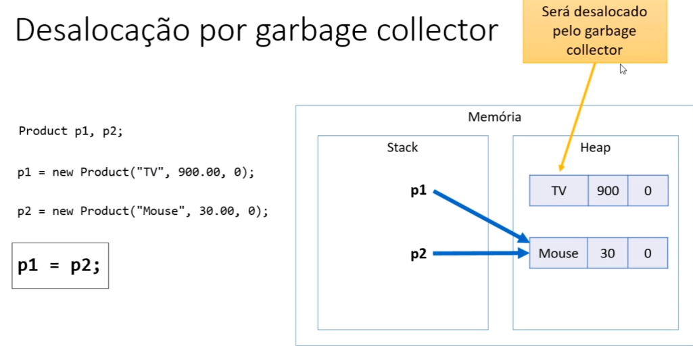

Desalocação por escopo

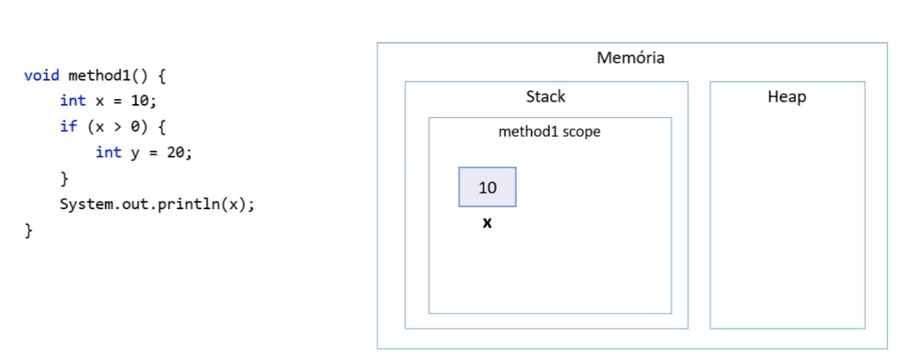

## Resumo

* Objetos alocados dinamicamente, quando não possuem mais referência para eles, serão desalocados pelo garbage collector

* Variáveis locais são desalocadas iimediatamente assim que seu escopo local sai de execução.
