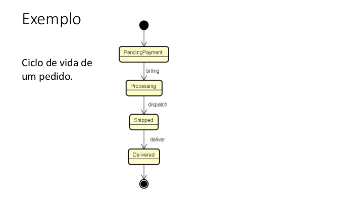
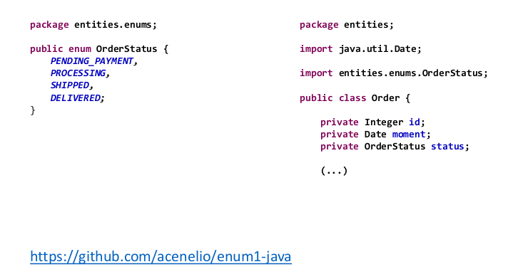
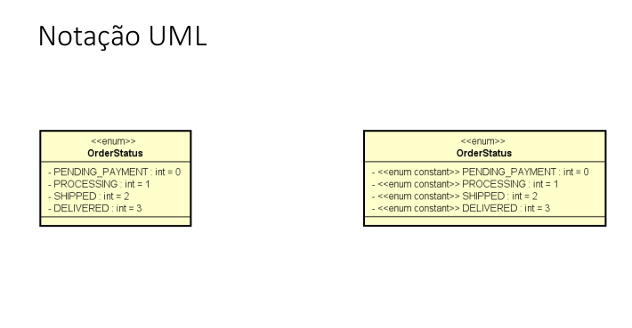
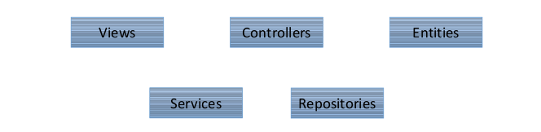
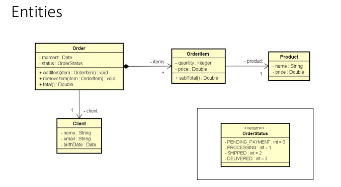
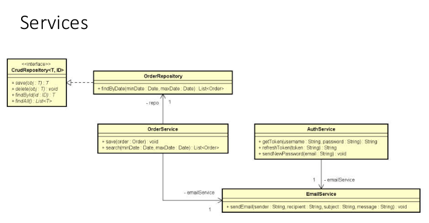
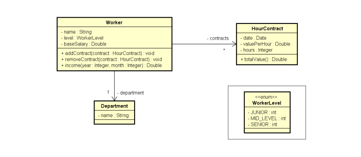
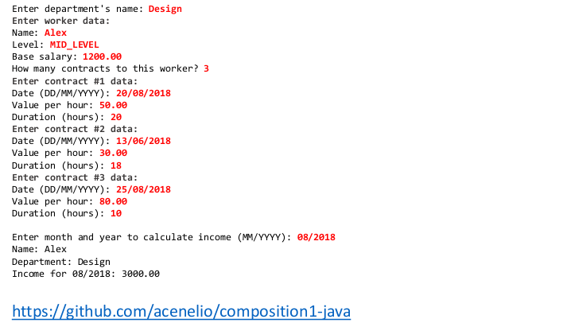
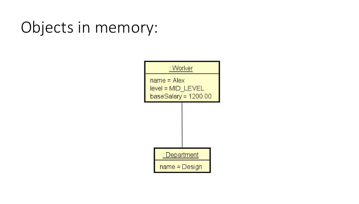
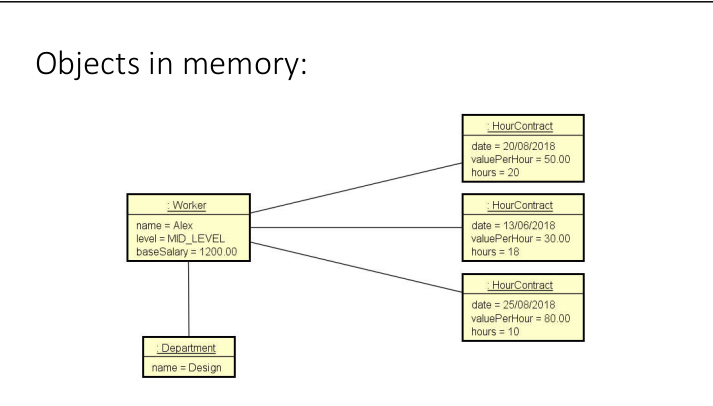

# Enumerações

## Checklist

* Definição /discussão

* Exemplo: estados de um pedido

* Conversão de string para enum

* Representação UML

## Enumerações 2

* É um tipo especial que serve para especificar de forma literal um conjunto de constantes relacionadas.

* Palavra chave em java: enum

* Vantagem: melhor semântica, código mais legível e auxiliado pelo compilador

* Referência: <https://docs.oracle.com/javase/tutorial/javaOO/enum.html>

## Conversão de String para enum

OrderStatus os1 = OrderStatus.DELIVERED

OrderStatus os2 = OrderStatus.valueof("DELIVERED")

## Vamos falar um pouco de design

### Categorias de classes

* Em um sistema oriente a objetos, de modo geral "tudo" é objeto.

* Por questões de design tais como organização, flexibilidade, reuso, delegação, etc., há várias categorias de classes:

## Composição

### Composição conceito

* É um tipo de associação que permite que um objeto contenha outro

* Relação "tem-um" ou "tem-vários"

* Vantagens

=> Organização: divisão de responsabilidades

=> Coesão

=> Flexibilidade

=> Reuso

* Nota: embora o símbolo UML para composição (todo-parte) seja o diamante preto, neste contexto estamos chamando de composição qualquer associação tipo "tem-um" e "tem-vários"

## Exercicos

Ler os dados de um trabalhador com N contratos (N fornecido pelo usuário). Depois, solicitar
do usuário um mês e mostrar qual foi o salário do funcionário nesse mês, conforme exemplo
(próxima página).

